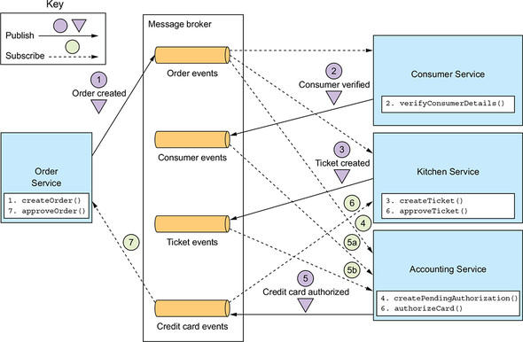
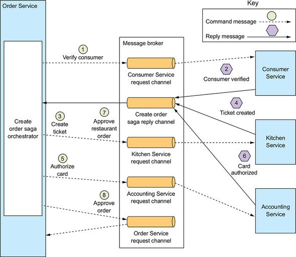

## Sagaコーディネーション

Sagaの実装は各ステップをコーディネートするコードから作られており、下記2通りの手法が存在する

#### 1. Choreography (コレオグラフィ)  
ワークフロー全体を管理するコントローラーを立てず、各サービスが自立分散的に動作することで整合性を保つ方式  
Sagaの参加サービスが相互に相手のイベントをサブスクライブし、それをトリガーに適切な処理を行う   

Choreography実装パターン例  

**考慮点**
- DB更新とイベントのパブリッシュがアトミックに実行されること
- Sagaの参加サービス間でデータを対応付けられるように設計する必要があること

**メリット**
- 一元的な制御モジュールが不要であるため、単一障害点がないこと
- 各サービスの動きが単純でシンプルであること

**デメリット**
- Saga全体を管理するコーディネーターが存在しないため、ワークフローの把握が難しく、実装が複雑・煩雑化する
- 新たなサービスを追加する際の影響範囲が大きい
- 他サービスは自分に影響するイベントをサブスクライブする必要があるため、相互が密結合になる

#### 2. Orchestration (オーケストレーション)  
Sagaサービスに指示を与えるオーケストレーションを定義し、中央集権的に全体を管理する方式  
オーケストレーター(コントローラー)と参加サービスが通信を行い、サービスはそれをトリガーに指示された処理を行う  

Orchestration実装パターン例  

**状態マシンを利用したモデリング方法**  
- 状態マシンを用いると、個々の状態及び状態遷移を管理、可視化することができ、ワークフローの制御やテスト実行も容易となる  
- 状態遷移によって適切なアクションを定義することで、各サービスを適切に動作させることが可能  
- 各サービスはローカルDBの更新とオーケストレーターへのメッセージ送信をアトミックに行う必要がある(=トランザクショナルメッセージング)  

**メリット**
- 依存関係が一方向で単純であるため、ワークフローの把握や追跡がしやすい
- 状態マシン等を用いることで、ワークフローの全体の制御がしやすい
- 各サービスはオーケストレーター以外と通信を行わないため、コレオグラフィと比較して疎結合な構成を組みやすい

**デメリット**
- オーケストレーターという単一障害点が発生し、オーケストレーターに障害が発生するとワークフロー全体が機能しない
- サービスの修正に対して常にオーケストレーターの追加実装が必要となる

